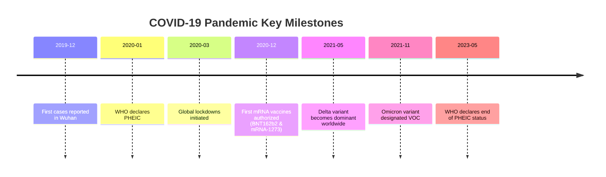

# The Global Impact of COVID-19: Pandemic Dynamics, Scientific Breakthroughs, and Socioeconomic Metamorphosis

> **Abstract:** The COVID-19 pandemic, caused by the novel coronavirus SARS-CoV-2, represents one of the most transformative global health crises of the 21st century. Emerging in late 2019, the pathogen precipitated unprecedented widespread healthcare disruptions, economic contractions, and paradigm shifts in biopharmaceutical research.

---

## 1. Introduction & Epidemiological Overview

SARS-CoV-2 is a single-stranded positive-sense RNA virus belonging to the *Coronaviridae* family. Transmitted primarily through respiratory droplets and aerosols, the virus quickly traversed international borders, leading the World Health Organization (WHO) to declare a Public Health Emergency of International Concern (PHEIC) on January 30, 2020, and a pandemic on March 11, 2020.

### 1.1 Viral Morphology & Receptor Binding

The hallmark feature of SARS-CoV-2 is the transmembrane **Spike (S) glycoprotein**, which forms homotrimers protruding from the viral surface. The receptor-binding domain (RBD) of the spike protein binds with high affinity to the human `ACE2` (Angiotensin-Converting Enzyme 2) receptor.

#### 1.1.1 Structural Specifics

* **Genome Length:** ~29.9 kb
* **Envelope Proteins:** Membrane (M), Envelope (E), Spike (S), Nucleocapsid (N)
* **Cleavage Site:** Polybasic furin cleavage site at the S1/S2 boundary

##### Key Variants of Concern (VOCs)

1. **Alpha (B.1.1.7):** Identified in the UK (late 2020)
2. **Delta (B.1.617.2):** High transmissibility and viral load
3. **Omicron (B.1.1.529):** Extensive neutralization escape mutations

###### Epidemiological Parameters

$$R_0 \approx 2.5 - 5.7 \quad \text{(Ancestral Strain)}$$

---

## 2. Mathematical Modeling & Transmission Dynamics

Epidemiologists employed compartmentalized differential equations to track infection rates, hospitalization requirements, and immunity thresholds.

### 2.1 The SEIR Model

The classic **SEIR** (Susceptible-Exposed-Infectious-Recovered) model is formulated as:

$$\begin{aligned}
\frac{dS}{dt} &= -\frac{\beta S I}{N} \\
\frac{dE}{dt} &= \frac{\beta S I}{N} - \sigma E \\
\frac{dI}{dt} &= \sigma E - \gamma I \\
\frac{dR}{dt} &= \gamma I
\end{aligned}$$

Where:
- $\beta$ is the transmission rate.
- $\sigma$ is the rate of exposure to infection ($1/\sigma$ is the incubation period).
- $\gamma$ is the recovery rate ($1/\gamma$ is the infectious period).

### 2.2 Effective Reproduction Number ($R_t$)

The effective reproduction rate incorporating public health interventions (lockdowns, masking, vaccination) is given by:

$$R_t = R_0 \cdot \left( \frac{S(t)}{N} \right) \cdot (1 - c)$$

Where $c$ represents the compliance coefficient of non-pharmaceutical interventions (NPIs).

---

## 3. Global Public Health Interventions & Timeline



---

## 4. Clinical Manifestations & Diagnostic Modalities

COVID-19 manifests with a broad spectrum of clinical severity, ranging from asymptomatic infection to acute respiratory distress syndrome (ARDS) and multi-organ failure.

| Diagnostic Test | Target | Sensitivity | Turnaround Time | Best Use Case |
| :--- | :--- | :---: | :---: | :--- |
| **RT-PCR** | Viral RNA (`ORF1ab`, `N`, `E` genes) | High (>95%) | 2–24 Hours | Gold Standard Clinical Diagnosis |
| **Rapid Antigen** | Nucleocapsid Protein | Moderate (70–85%) | 15 Minutes | Point-of-Care & Mass Screening |
| **Serology / Antibody** | Anti-Spike / Anti-N IgG/IgM | Variable | 1–3 Days | Population Surveillance & Prior Immunity |

### 4.1 Diagnostic Workflow (RT-PCR Algorithm)

```python
def evaluate_pcr_sample(ct_val_target1: float, ct_val_target2: float, threshold: float = 35.0) -> str:
    """Evaluates RT-PCR Cycle Threshold (Ct) values for SARS-CoV-2 detection."""
    if ct_val_target1 <= threshold and ct_val_target2 <= threshold:
        return "POSITIVE: High viral load"
    elif ct_val_target1 <= threshold or ct_val_target2 <= threshold:
        return "INCONCLUSIVE: Re-test recommended"
    else:
        return "NEGATIVE: Viral RNA not detected"

# Example Evaluation
sample_result = evaluate_pcr_sample(22.4, 23.1)
print(f"Laboratory Status: {sample_result}")
```

---

## 5. Therapeutics & Vaccine Innovation

The rapid development of **mRNA vaccines** marked a landmark achievement in medical biotechnology.

### 5.1 Vaccine Platforms Comparison

- **mRNA Vaccines:** Lipid nanoparticle (LNP) encapsulated mRNA encoding full-length spike protein (e.g., Pfizer-BioNTech `BNT162b2`, Moderna `mRNA-1273`).
- **Viral Vector Vaccines:** Non-replicating adenoviral vectors expressing spike gene (e.g., Oxford-AstraZeneca `ChAdOx1-S`, Johnson & Johnson `Ad26.COV2.S`).
- **Protein Subunit:** Recombinant spike protein nanoparticle with adjuvant (e.g., Novavax `NVX-CoV2373`).

### 5.2 Antiviral Pharmacotherapy

```rust
struct AntiviralAgent {
    name: String,
    mechanism_of_action: String,
    target_protein: String,
    efficacy_reduction_hospitalization: f32,
}

fn get_standard_care() -> Vec<AntiviralAgent> {
    vec![
        AntiviralAgent {
            name: String::from("Nirmatrelvir / Ritonavir (Paxlovid)"),
            mechanism_of_action: String::from("3CL protease inhibitor (Mpro)"),
            target_protein: String::from("Main Protease (Nsp5)"),
            efficacy_reduction_hospitalization: 0.89,
        },
        AntiviralAgent {
            name: String::from("Remdesivir (Veklury)"),
            mechanism_of_action: String::from("Nucleoside analog RNA polymerase inhibitor"),
            target_protein: String::from("RdRp (Nsp12)"),
            efficacy_reduction_hospitalization: 0.87,
        },
    ]
}
```

---

## 6. Socioeconomic Implications & Lessons Learned

The systemic impact stretched far beyond healthcare facilities:

1. **Remote Work & Education:** Unprecedented adoption of video conferencing, cloud workspaces, and digital collaboration software.
2. **Global Supply Chain Resilience:** Vulnerabilities uncovered in critical medical equipment supply chains (`PPE`, ventilators, active pharmaceutical ingredients).
3. **Mental Health Challenges:** Widespread anxiety, isolation, and burnout among frontline healthcare personnel.

> "The pandemic demonstrated that global health security is inextricably linked to socioeconomic stability, biomanufacturing distribution, and international scientific transparency."

### 6.1 Action Items for Future Pandemic Preparedness

- [x] Establish global genomic surveillance networks
- [x] Pre-fund rapid vaccine platform manufacturing facilities
- [ ] Universal broad-spectrum coronavirus vaccine development
- [ ] Equitable distribution frameworks for therapeutics in low-income nations

---

## 7. Further Reading & References

* World Health Organization: [COVID-19 Technical Guidance](https://www.who.int)
* CDC COVID Data Tracker: [Genomic Surveillance](https://covid.cdc.gov)
* Nature Biotechnology: *mRNA Vaccine Modalities and Future Horizons* (2021)
